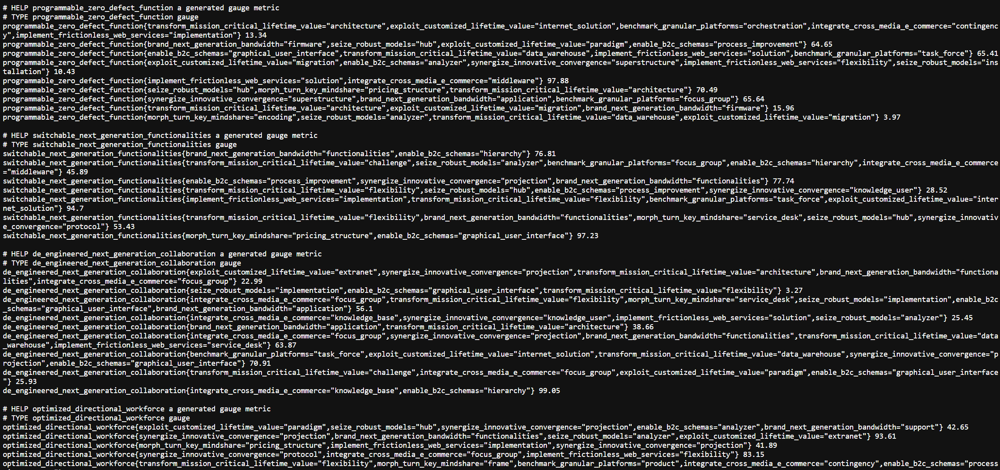

# Fake metrics generator

This project generates fake metrics that can be scraped and pushed to a prometheus instance.



## Running from checkout

1. Install dependencies `yarn`
2. Copy src/config/config.json.example to src/config/config.json and edit it to your liking.
   See [configuration](#configuration) for more details.
   `cp src/config/config.json.example src/config/config.json`
3. Run the server

```bash
# 1. via docker compose
yarn build & docker compose up -d
# 2. via yarn in watch mode
yarn dev
# 3. via yarn
yarn start
```

## Running from release

1. Download the latest release from [here](https://github.com/grafana/fake-metrics-generator/releases)
2. Extract the archive
3. Run the server

The release archive includes a precompiled bundle that only needs nodejs to run. It also includes a `docker-compose.yml`
file which will run the server in a docker container exposing port `5000`

## Access the metrics

After you have the server running all you need to do is point your browser or scraper at `localhost:5000/metrics`

## Configuration

The configuration file is located at `src/config/config.json`. The following is the default configuration:

```typescript
type Config = {
    collectDefaultMetrics: boolean; // Whether to include default metrics for prom-client
    labels: { // labels config
        prefix: string; // The prefix to add to all labels; Defaults to "fake", set to '' to disable
        perMetric: number | [number /*min*/, number /*max*/]; // The number of labels to generate per metric can be a range
        qtyForValueRotation?: number; // A number of labels that will have their values rotated on a cron schedule
        rotationCronSchedule?: string; // A cron schedule for rotating the values of labels defaults to every 6 hours
        valueVariations: number; // How many different values a label can have
    },
    metrics: { // metrics config
        prefix: string; // The prefix to add to all metrics; Defaults to "fake_", set to '' to disable
        quantity: number; // How many metrics to generate
        timeSeries: number | [number /*min*/, number /*max*/]; // The number of time series to generate per metric can be a range
    },
    persistBetweenRuns: boolean; // Whether to save the generated metrics and labels to a file to use on a future run
}
```

The configuration for `labels.qtyForValueRotation` and `labels.rotationCronSchedule` is intended to generate churn in your metric time
series. This is useful when a service you depend on is expecting changes to label values. E.g. `pod`

For help configuring a cron schedule you can use [crontab guru](https://crontab.guru/)
